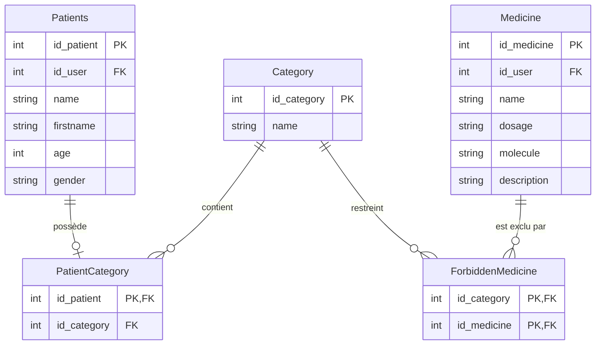

# Documentation Technique & Cahier de Recette
## Projet : gsbMonolith

Cette documentation décrit les modifications techniques apportées au projet **gsbMonolith**, le schéma de base de données associé, ainsi que les protocoles de tests (Cahier de Recette) permettant de valider le bon fonctionnement des fonctionnalités.

---

## 1. Feature 1 : Catégories de Patients & Contre-indications

### Architecture & Schéma Relationnel (Base de données)
Pour garantir l'évolution du système sans altérer la structure physique des tables existantes (`Patients` et `Medicine`), nous avons opté pour une approche modulaire en introduisant des tables de liaison. Cela évite les régressions sur la base de données héritée (legacy).



### Scripts de Création des Tables (SQL)

```sql
-- 1. Table des catégories (Femme enceinte, Enfant, etc.)
CREATE TABLE `Category` (
  `id_category` int NOT NULL AUTO_INCREMENT,
  `name` varchar(100) NOT NULL,
  PRIMARY KEY (`id_category`)
) ENGINE=InnoDB DEFAULT CHARSET=utf8mb4;

-- Insertion des catégories requises
INSERT INTO `Category` (`id_category`, `name`) VALUES
(1, 'Femme enceinte'),
(2, 'Enfant'),
(3, 'Personne âgée'),
(4, 'Diabétique');

-- 2. Table d'association Patient <-> Catégorie
CREATE TABLE `PatientCategory` (
  `id_patient` int NOT NULL,
  `id_category` int NOT NULL,
  PRIMARY KEY (`id_patient`),
  CONSTRAINT `fk_pc_patient` FOREIGN KEY (`id_patient`) REFERENCES `Patients` (`id_patient`) ON DELETE CASCADE,
  CONSTRAINT `fk_pc_category` FOREIGN KEY (`id_category`) REFERENCES `Category` (`id_category`) ON DELETE CASCADE
) ENGINE=InnoDB DEFAULT CHARSET=utf8mb4;

-- Attribution de catégories par défaut
INSERT INTO `PatientCategory` (`id_patient`, `id_category`) VALUES
(1, 1),   -- Dupont Marie -> Femme enceinte
(13, 2),  -- Masson Emma -> Enfant
(5, 3);   -- Fournier Chantal -> Personne âgée

-- 3. Table de contre-indication (Catégorie <-> Médicament)
CREATE TABLE `ForbiddenMedicine` (
  `id_category` int NOT NULL,
  `id_medicine` int NOT NULL,
  PRIMARY KEY (`id_category`, `id_medicine`),
  CONSTRAINT `fk_fm_category` FOREIGN KEY (`id_category`) REFERENCES `Category` (`id_category`) ON DELETE CASCADE,
  CONSTRAINT `fk_fm_medicine` FOREIGN KEY (`id_medicine`) REFERENCES `Medicine` (`id_medicine`) ON DELETE CASCADE
) ENGINE=InnoDB DEFAULT CHARSET=utf8mb4;

-- Interdictions de sécurité médicale (jeu d'essai)
INSERT INTO `ForbiddenMedicine` (`id_category`, `id_medicine`) VALUES
(1, 2), -- Femme enceinte : Ibuprofène interdit
(2, 5), -- Enfant : Lexomil interdit
(2, 6); -- Enfant : Seroplex interdit
```

### Implémentation Logicielle (C# / WinForms)
- **Modèles :** Introduction de la classe `Category.cs` ; ajout de `Id_category` et `CategoryName` à `Patient.cs` et de `ForbiddenCategoryIds` à `Medicine.cs`.
- **DAOs :** Création de `CategoryDAO.cs`. Modification de `PatientDAO.cs` et `MedicineDAO.cs` pour persister les associations dans les tables de liaison.
- **Vues :** Menu déroulant de choix de catégorie dans `PatientEditForm.cs`, liste des contre-indications à cocher dans `MedicineEditForm.cs`, et contrôle de sécurité bloquant dans `PrescriptionEditForm.cs`.

---

## 2. Feature 2 : Cloisonnement des Patients par Médecin

### Principe de Conception (1 méthode = 1 fonctionnalité)
Afin de respecter scrupuleusement les consignes pédagogiques du BTS, **les méthodes existantes d'accès global aux données (`GetAllPatients`, `GetAllPrescriptions`, etc.) n'ont pas été modifiées**.

Nous avons implémenté de nouvelles méthodes dédiées dans la couche DAO pour exécuter le filtrage directement au niveau de la base de données, évitant ainsi le chargement inutile de données en mémoire.

### Nouveaux Composants de la couche DAO
Dans **[PatientDAO.cs](file:///c:/Users/sylux/Documents/git/gsbMonolith/DAO/PatientDAO.cs)** :
1. `GetPatientsByDoctorId(int id_user)` : Retourne la liste des patients attribués à un médecin spécifique.
2. `GetPatientsForComboBoxByDoctorId(int id_user)` : Retourne une liste filtrée pour le menu déroulant lors de la création d'ordonnances.

Dans **[PrescriptionDAO.cs](file:///c:/Users/sylux/Documents/git/gsbMonolith/DAO/PrescriptionDAO.cs)** :
1. `GetPrescriptionsByDoctorId(int id_user)` : Retourne uniquement les ordonnances créées par le médecin connecté.

### Intégration dans les Vues
- Si l'utilisateur est un **Administrateur** (`currentUser.Role == true`) : Utilisation des méthodes globales `GetAll` pour voir tout le parc de la clinique.
- Si l'utilisateur est un **Médecin** (`currentUser.Role == false`) : Utilisation systématique des méthodes filtrées par identifiant médecin (`currentUser.Id`).

---

## 3. Feature 3 : Sécurisation de la Suppression des Patients

### Spécification du besoin
La suppression d'un patient disposant d'un historique médical (prescriptions passées) est une opération critique. Pour éviter des pertes de traçabilité accidentelles, nous devons interdire cette opération aux médecins.

### Logique appliquée
- Si l'utilisateur connecté est un **Médecin** (`Role == false`) :
  - Si le patient a au moins une prescription existante : **La suppression est bloquée** et un message d'erreur est affiché.
  - Si le patient n'a aucune prescription : **La suppression est autorisée**.
- Si l'utilisateur connecté est un **Administrateur** (`Role == true`) :
  - Il conserve le droit de supprimer n'importe quel patient (la suppression s'exécute alors en cascade).

### Composants implémentés
- **DAO :** Ajout de la méthode `HasPrescriptions(int id_patient)` dans `PrescriptionDAO.cs` qui effectue un comptage rapide (`SELECT COUNT(*)`) en base de données.
- **IHM :** Modification de `BtnDelete_Click` dans `PatientsView.cs` pour intercepter l'opération de suppression et appliquer le contrôle.

---

## 4. Cahier de Recette (Scénarios de Validation)

### Scénario de Test 1 : Assigner une catégorie à un patient
* **Objectif :** Affecter un patient à une catégorie et persister en base.
* **Actions IHM :**
  1. Aller sur l'onglet **Gestion des Patients** et éditer le patient *Dupont Marie*.
  2. Sélectionner "Femme enceinte" dans *Catégorie de patient* et enregistrer.
* **Résultat attendu :** La colonne **Catégorie** affiche "Femme enceinte" dans le tableau.
* **Vérification SQL :**
  ```sql
  SELECT p.firstname, p.name, c.name AS categorie
  FROM Patients p
  INNER JOIN PatientCategory pc ON p.id_patient = pc.id_patient
  INNER JOIN Category c ON pc.id_category = c.id_category
  WHERE p.name = 'Dupont';
  ```

### Scénario de Test 2 : Définir un médicament interdit pour une catégorie
* **Objectif :** Bannir un médicament pour une certaine population de patients.
* **Actions IHM :**
  1. Aller sur l'onglet **Gestion des Médicaments** et éditer *Ibuprofène*.
  2. Cocher "Femme enceinte" dans les contre-indications et enregistrer.
* **Vérification SQL :**
  ```sql
  SELECT m.name AS medicament, c.name AS categorie_interdite
  FROM ForbiddenMedicine fm
  INNER JOIN Medicine m ON fm.id_medicine = m.id_medicine
  INNER JOIN Category c ON fm.id_category = c.id_category
  WHERE m.name = 'Ibuprofène';
  ```

### Scénario de Test 3 : Sécurité de la prescription (Cas bloquant)
* **Objectif :** Empêcher la prescription d'un médicament contre-indiqué.
* **Actions IHM :**
  1. Aller sur l'onglet **Prescriptions** et cliquer sur **Nouvelle Prescription**.
  2. Choisir le patient *Dupont Marie* (catégorie : *Femme enceinte*).
  3. Sélectionner *Ibuprofène* et cliquer sur **Ajouter**.
* **Résultat attendu :** Une pop-up d'erreur bloque l'ajout avec le message :
  > *« Le médicament 'Ibuprofène' est interdit / contre-indiqué pour la catégorie 'Femme enceinte' de ce patient ! »*

### Scénario de Test 4 : Cloisonnement médecin (Accès restreint)
* **Objectif :** S'assurer qu'un médecin ne voit que ses propres dossiers.
* **Actions :**
  1. Se connecter avec le compte de médecin d'Alice Martin (ID = 1).
  2. Aller sur l'onglet **Gestion des Patients**.
* **Résultat attendu :** Seuls les patients associés à son compte s'affichent.
* **Vérification SQL :**
  ```sql
  SELECT id_patient, name, firstname, id_user FROM Patients WHERE id_user = 1;
  ```

### Scénario de Test 5 : Accès administrateur (Vue globale)
* **Objectif :** S'assurer que l'administrateur conserve un accès total.
* **Actions :**
  1. Se connecter avec le compte d'administrateur de Sarah Lemoine (ID = 5).
  2. Cliquer sur l'onglet **Gestion des Patients**.
* **Résultat attendu :** Tous les patients de la clinique s'affichent.
* **Vérification SQL :**
  ```sql
  SELECT COUNT(*) FROM Patients;
  ```

### Scénario de Test 6 : Filtrage dans la création d'ordonnance
* **Objectif :** Restreindre le choix des patients lors de la rédaction d'une ordonnance.
* **Actions :**
  1. Se connecter avec le compte d'Alice Martin (ID = 1).
  2. Aller sur **Prescriptions** -> **Nouvelle Prescription** -> Dérouler la liste *Patient*.
* **Résultat attendu :** Seuls les patients d'Alice Martin sont sélectionnables.
* **Vérification SQL :**
  ```sql
  SELECT id_patient, firstname, name FROM Patients WHERE id_user = 1 ORDER BY name, firstname ASC;
  ```

### Scénario de Test 7 : Blocage de suppression (Médecin connecté)
* **Objectif :** Vérifier qu'un médecin ne peut pas effacer un patient ayant un dossier de prescriptions.
* **Actions :**
  1. Se connecter avec le compte de médecin d'Alice Martin (ID = 1).
  2. Aller dans la **Gestion des Patients**.
  3. Sélectionner le patient *Dupont Marie* (qui dispose déjà de prescriptions en base).
  4. Cliquer sur **Supprimer**.
* **Résultat attendu :** Une boîte de dialogue d'avertissement s'affiche :
  > *« Impossible de supprimer ce patient car des prescriptions lui ont été attribuées. »*
  - Le patient n'est pas supprimé de l'IHM.
* **Vérification SQL de sécurité :**
  ```sql
  SELECT COUNT(*) FROM Patients WHERE name = 'Dupont' AND firstname = 'Marie';
  ```
  *(Résultat attendu : 1. Prouve que le patient est toujours présent).*

### Scénario de Test 8 : Suppression d'un patient sans prescription (Médecin connecté)
* **Objectif :** Autoriser la suppression si aucun historique médical n'est menacé.
* **Actions :**
  1. Se connecter avec le compte d'Alice Martin (ID = 1).
  2. Cliquer sur **Nouveau Patient**, créer un patient factice (ex: *Test Suppression*, âge: 20, genre: M) sans lui prescrire aucun médicament.
  3. Sélectionner ce nouveau patient factice dans la liste et cliquer sur **Supprimer**.
  4. Confirmer la suppression.
* **Résultat attendu :** La suppression réussit sans avertissement de blocage. Le patient disparaît de l'écran.
* **Vérification SQL :**
  ```sql
  SELECT COUNT(*) FROM Patients WHERE name = 'Test Suppression';
  ```
  *(Résultat attendu : 0).*

### Scénario de Test 9 : Suppression d'un patient par l'administrateur (Accès total)
* **Objectif :** Valider le comportement de suppression globale d'administration.
* **Actions :**
  1. Se connecter avec le compte d'administrateur de Sarah Lemoine (ID = 5).
  2. Aller dans la **Gestion des Patients**.
  3. Sélectionner le patient *Bernard Luc* (qui possède des ordonnances).
  4. Cliquer sur **Supprimer** et confirmer.
* **Résultat attendu :** Le patient est supprimé sans blocage de prescription.
* **Vérification SQL de la suppression en cascade :**
  ```sql
  -- Vérifier que le patient est supprimé
  SELECT COUNT(*) FROM Patients WHERE id_patient = 2; -- Doit renvoyer 0
  -- Vérifier que ses ordonnances associées ont été automatiquement purgées
  SELECT COUNT(*) FROM Prescription WHERE id_patient = 2; -- Doit renvoyer 0
  ```
