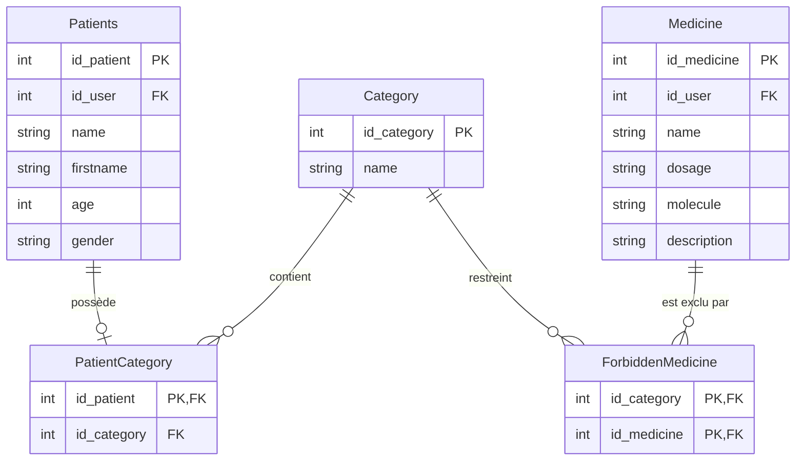

# Documentation Technique & Cahier de Recette
## Feature : Catégories de Patients & Contre-indications Médicamenteuses

Cette documentation décrit les modifications techniques apportées au projet **gsbMonolith**, le schéma de base de données associé, ainsi que les protocoles de tests (Cahier de Recette) permettant de valider le bon fonctionnement de la fonctionnalité.

---

## 1. Architecture & Schéma Relationnel (Base de données)

### Choix de Conception Technique
Pour garantir l'évolution du système sans altérer la structure physique des tables existantes (`Patients` et `Medicine`), nous avons opté pour une approche modulaire en introduisant des tables de liaison. Cela évite les régressions sur la base de données héritée (legacy) et assure la conformité aux exigences du sujet.



### Scripts de Création des Tables (SQL)

```sql
-- 1. Table des catégories (Femme enceinte, Enfant, etc.)
CREATE TABLE `Category` (
  `id_category` int NOT NULL AUTO_INCREMENT,
  `name` varchar(100) NOT NULL,
  PRIMARY KEY (`id_category`)
) ENGINE=InnoDB DEFAULT CHARSET=utf8mb4;

-- Insertion des jeux de données de test requis
INSERT INTO `Category` (`id_category`, `name`) VALUES
(1, 'Femme enceinte'),
(2, 'Enfant'),
(3, 'Personne âgée'),
(4, 'Diabétique');

-- 2. Table d'association Patient <-> Catégorie (relation 1-à-1 ou 1-à-0)
-- La clé primaire sur id_patient garantit l'unicité de la catégorie pour un patient donné
CREATE TABLE `PatientCategory` (
  `id_patient` int NOT NULL,
  `id_category` int NOT NULL,
  PRIMARY KEY (`id_patient`),
  CONSTRAINT `fk_pc_patient` FOREIGN KEY (`id_patient`) REFERENCES `Patients` (`id_patient`) ON DELETE CASCADE,
  CONSTRAINT `fk_pc_category` FOREIGN KEY (`id_category`) REFERENCES `Category` (`id_category`) ON DELETE CASCADE
) ENGINE=InnoDB DEFAULT CHARSET=utf8mb4;

-- Attribution de catégories par défaut pour le jeu d'essai
INSERT INTO `PatientCategory` (`id_patient`, `id_category`) VALUES
(1, 1),   -- Dupont Marie -> Femme enceinte
(13, 2),  -- Masson Emma -> Enfant
(5, 3);   -- Fournier Chantal -> Personne âgée

-- 3. Table de contre-indication (Catégorie <-> Médicament)
CREATE TABLE `ForbiddenMedicine` (
  `id_category` int NOT NULL,
  `id_medicine` int NOT NULL,
  PRIMARY KEY (`id_category`, `id_medicine`),
  CONSTRAINT `fk_fm_category` FOREIGN KEY (`id_category`) REFERENCES `Category` (`id_category`) ON DELETE CASCADE,
  CONSTRAINT `fk_fm_medicine` FOREIGN KEY (`id_medicine`) REFERENCES `Medicine` (`id_medicine`) ON DELETE CASCADE
) ENGINE=InnoDB DEFAULT CHARSET=utf8mb4;

-- Interdictions de sécurité médicale (jeu d'essai)
INSERT INTO `ForbiddenMedicine` (`id_category`, `id_medicine`) VALUES
(1, 2), -- Femme enceinte : Ibuprofène interdit
(2, 5), -- Enfant : Lexomil interdit
(2, 6); -- Enfant : Seroplex interdit
```

---

## 2. Implémentation Logicielle (C# / WinForms)

L'implémentation respecte le patron d'architecture **DAO (Data Access Object)** de l'application :

1. **Modèle de données :**
   - Addition de la classe `Category.cs` représentant une catégorie.
   - Ajout des propriétés optionnelles `Id_category` et `CategoryName` dans `Patient.cs` pour transporter l'information sans altérer l'objet d'origine.
   - Ajout de la propriété `ForbiddenCategoryIds` dans `Medicine.cs`.

2. **Accès aux données (DAO) :**
   - Création de `CategoryDAO.cs` avec les méthodes `GetAllCategories()` et `IsMedicineForbidden(int catId, int medId)` pour vérifier la sécurité de la prescription en temps réel.
   - Modification de `PatientDAO.cs` :
     - Utilisation d'un `LEFT JOIN` avec la table associative pour récupérer la catégorie lors du listage de tous les patients.
     - Gestion des liaisons dans `Insert` et `UpdatePatient`.
   - Modification de `MedicineDAO.cs` :
     - Gestion de l'enregistrement des interdictions dans `ForbiddenMedicine` lors de l'insertion ou de la modification d'un médicament.

3. **Interface Graphique & Validation :**
   - **Formulaire Patient :** Intégration d'une `ComboBox` pour affecter une catégorie de patient (avec option "Aucune").
   - **Formulaire Médicament :** Intégration d'une `CheckedListBox` listant les catégories à exclure.
   - **Validation de Prescription :** Vérification instantanée lors de l'événement d'ajout d'un médicament et lors de la sauvegarde finale de la prescription dans `PrescriptionEditForm.cs`.

---

## 3. Cahier de Recette (Scénarios de Validation)

Cette partie présente les étapes permettant de prouver la robustesse de l'application lors de la soutenance.

### Scénario de Test 1 : Assigner une catégorie à un patient
* **Objectif :** Vérifier qu'un médecin peut catégoriser un patient et que la liaison est persistée en base de données.
* **Actions IHM :**
  1. Aller sur l'onglet **Gestion des Patients**.
  2. Double-cliquer sur le patient *Dupont Marie* ou cliquer sur *Nouveau Patient*.
  3. Sélectionner "Femme enceinte" dans la liste déroulante *Catégorie de patient*.
  4. Cliquer sur *Enregistrer*.
* **Résultat attendu :**
  - La fenêtre se ferme sans erreur.
  - La colonne **Catégorie** affiche "Femme enceinte" pour le patient dans le tableau de bord.
* **Vérification SQL :**
  ```sql
  SELECT p.firstname, p.name, c.name AS categorie
  FROM Patients p
  INNER JOIN PatientCategory pc ON p.id_patient = pc.id_patient
  INNER JOIN Category c ON pc.id_category = c.id_category
  WHERE p.name = 'Dupont' AND p.firstname = 'Marie';
  ```
  *(Résultat attendu : une ligne renvoyant 'Marie', 'Dupont', 'Femme enceinte')*

### Scénario de Test 2 : Définir un médicament interdit pour une catégorie
* **Objectif :** Configurer une contre-indication sur un produit pharmaceutique.
* **Actions IHM :**
  1. Aller sur l'onglet **Gestion des Médicaments**.
  2. Double-cliquer sur le médicament *Ibuprofène*.
  3. Dans la liste à cocher des contre-indications, cocher "Femme enceinte".
  4. Cliquer sur *Enregistrer*.
* **Résultat attendu :**
  - Les modifications sont enregistrées.
* **Vérification SQL :**
  ```sql
  SELECT m.name AS medicament, c.name AS categorie_interdite
  FROM ForbiddenMedicine fm
  INNER JOIN Medicine m ON fm.id_medicine = m.id_medicine
  INNER JOIN Category c ON fm.id_category = c.id_category
  WHERE m.name = 'Ibuprofène';
  ```
  *(Résultat attendu : une ligne associant 'Ibuprofène' à 'Femme enceinte')*

### Scénario de Test 3 : Sécurité de la prescription (Cas nominal bloquant)
* **Objectif :** Empêcher la validation d'une ordonnance contenant un médicament interdit pour le profil du patient.
* **Actions IHM :**
  1. Aller sur l'onglet **Prescriptions** et cliquer sur **Nouvelle Prescription**.
  2. Choisir le patient *Dupont Marie* (catégorie : *Femme enceinte*).
  3. Sélectionner le médicament *Ibuprofène* dans la liste déroulante et cliquer sur le bouton **Ajouter**.
* **Résultat attendu :**
  - Un message d'erreur pop-up bloquant s'affiche :
    > *« Le médicament 'Ibuprofène' est interdit / contre-indiqué pour la catégorie 'Femme enceinte' de ce patient ! »*
  - Le médicament **n'est pas ajouté** à la liste de la prescription en cours.
* **Vérification SQL de non-insertion :**
  Pour confirmer qu'aucune ligne illégale n'a été insérée en base de données :
  ```sql
  SELECT pr.id_prescription, p.name AS patient, m.name AS medicament
  FROM Appartient a
  INNER JOIN Prescription pr ON a.id_prescription = pr.id_prescription
  INNER JOIN Patients p ON pr.id_patient = p.id_patient
  INNER JOIN PatientCategory pc ON p.id_patient = pc.id_patient
  INNER JOIN Medicine m ON a.id_medicine = m.id_medicine
  INNER JOIN ForbiddenMedicine fm ON pc.id_category = fm.id_category AND m.id_medicine = fm.id_medicine;
  ```
  *(Résultat attendu : **0 ligne retournée**. Ce qui prouve qu'aucune prescription interdite n'est présente en base de données).*
